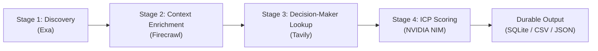

# ICP-Based Company & Decision-Maker Discovery Pipeline

An automated, open-source pipeline designed to discover prospective companies matching any custom Ideal Customer Profile (ICP), enrich company web context, identify key target decision-makers, and evaluate qualification fit using an LLM evaluator.

---

## Architecture Overview

The pipeline executes in 4 modular, configurable stages:



1. **Stage 1: Discovery (`Exa`)**
   * Executes semantic search queries and lookalike company finding (`findSimilar`) via Exa API.
   * Multi-key fallback support and configurable call caps to protect budget and rate quotas.
   * Normalizes domains and deduplicates against a local persistent store.

2. **Stage 2: Web Context Enrichment (`Firecrawl`)**
   * Scrapes prospective company websites and automatically identifies `/about`, `/team`, and `/company` leadership pages.
   * Extracts clean markdown representation of product features, operating models, and company descriptions.

3. **Stage 3: Decision-Maker Identification (`Tavily`)**
   * Searches for target executive personas (e.g. *"Head of Growth"*, *"VP of Marketing"*, *"Founder"*, *"CEO"*) based entirely on user configuration.
   * Extracts verified executive names, roles, and personal LinkedIn profile URLs.

4. **Stage 4: Dynamic ICP Scoring & Classification (`NVIDIA NIM`)**
   * Injects user-defined ICP criteria from `config.yaml` directly into an LLM scoring prompt.
   * Evaluates criteria satisfaction, generates structured fit scores (0.0 to 1.0), and flags qualified leads.

---

## Setup & Installation

### 1. Prerequisites
* Python 3.10+
* Git

### 2. Clone and Setup Virtual Environment
```bash
git clone <your-repo-url>
cd lead-discovery-pipeline

python -m venv .venv
# On Windows:
.venv\Scripts\activate
# On Linux/macOS:
source .venv/bin/activate

pip install -r requirements.txt
```

### 3. API Keys Configuration
Copy `.env.example` to `.env` and fill in your API credentials:

```bash
cp .env.example .env
```

| Service | Environment Variable | Required For |
| :--- | :--- | :--- |
| **Exa** | `EXA_API_KEY` (or `EXA_API_KEY_1..3`) | Stage 1: Semantic company search |
| **Firecrawl** | `FIRECRAWL_API_KEY` (or `FIRECRAWL_API_KEY_1..3`) | Stage 2: Web scraping & about-page extraction |
| **Tavily** | `TAVILY_API_KEY` | Stage 3: Decision-maker LinkedIn search |
| **NVIDIA NIM** | `NVIDIA_API_KEY` (or `NIM_API_KEY`) | Stage 4: LLM ICP scoring and classification |

---

## Configuration (`config.yaml`)

All discovery queries, target roles, criteria, and filters are controlled in `config.yaml`:

```yaml
# Stage 1: Discovery (Exa)
discovery:
  enabled: true
  call_cap: 10
  num_results_per_query: 10
  queries:
    - "B2B software platforms with customer operations workflows and API integrations"
  seed_urls:
    - "https://example.com"

# Stage 2: Web Scraping & Context Enrichment (Firecrawl)
enrichment:
  enabled: true
  timeout_seconds: 30.0
  max_content_length: 15000
  scrape_about_page: true

# Stage 3: Decision-Maker Identification (Tavily)
decision_maker:
  enabled: true
  target_roles:
    - "Head of Growth"
    - "VP of Marketing"
    - "Founder"
    - "CEO"
  max_search_results: 5

# Stage 4: Dynamic ICP Scoring (NVIDIA NIM)
classification:
  enabled: true
  model: "meta/llama-3.2-11b-vision-instruct"
  temperature: 0.0
  icp_criteria:
    - "Company provides a B2B SaaS or technology platform"
    - "Company is an early-to-mid stage growth company (roughly 10-150 headcount)"
    - "Demonstrated commercial traction or institutional funding"
    - "Has workflow, API, or automated capabilities in product"
  min_fit_score: 0.7

# Output Locations
storage:
  database_path: "data/leads.sqlite3"
  raw_leads_path: "data/raw_leads.json"
  enriched_leads_path: "data/enriched_leads.json"
  final_output_csv: "data/qualified_leads.csv"
```

---

## Running the Pipeline

To run the complete 4-stage pipeline:

```bash
python run.py
```

To run with a custom configuration file:

```bash
python run.py path/to/custom_config.yaml
```

---

## Example Output (Synthetic / Fabricated Sample)

All live run data is excluded from the repository. Below is an illustrative example of the generated CSV output (`data/qualified_leads.csv`):

```csv
company_name,domain,url,decision_maker_name,decision_maker_title,decision_maker_linkedin,fit_score,is_qualified,matched_criteria,unmatched_criteria,reasoning
Acme Cloud Systems,acmecloud.example,https://acmecloud.example,Alex Rivera,Head of Growth,https://www.linkedin.com/in/alex-rivera-sample,0.92,True,"B2B SaaS; 10-150 headcount; Workflow API features",,"Fully meets B2B SaaS criteria with active API-first workflow solution."
FlowOps Technologies,flowops.example,https://flowops.example,Morgan Vance,VP of Marketing,https://www.linkedin.com/in/morgan-vance-sample,0.85,True,"B2B SaaS; Demonstrated commercial traction",,"Strong product fit in enterprise operational workflow domain."
```

---

## Running Tests

The test suite includes deterministic unit and integration tests with mocked external APIs:

```bash
python -m pytest
```

---

## License

MIT License. Open-source and free to adapt for any lead discovery or ICP scoring workflows.
